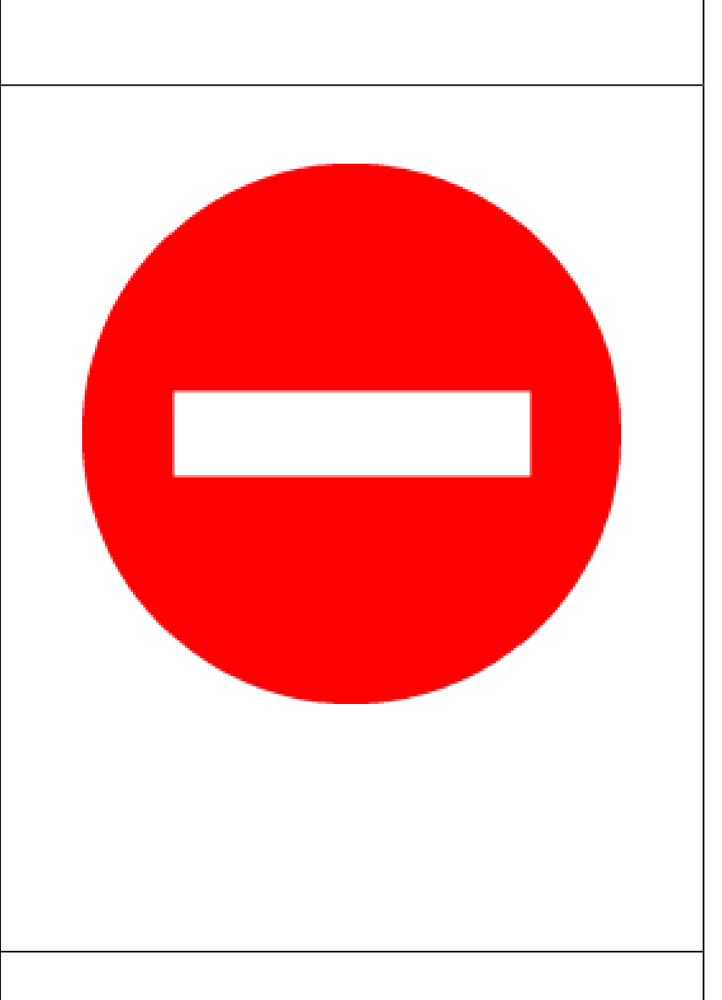

<div align="center">

# 📷 JetBot 路牌辨識與自動駕駛系統

**國立臺北科技大學 — 多媒體技術與應用 Project 6 小組成果**

[](https://www.python.org/)
[](https://pytorch.org/)
[](https://developer.nvidia.com/tensorrt)

</div>

## 👥 團隊資訊

* **學校**：國立臺北科技大學 電資學士班（電資二）
* **指導教授**：陳彥霖（Yen-Lin Chen）, Ph.D.
* **課程**：多媒體技術與應用 (Spring 2026)
* **小組組員**：
  * 113820033 謝奕宏
  * 113820020 林政德
  * 112820034 呂伊茹

---

## 📖 專案簡介與最新狀態

本專案為北科大「多媒體技術與應用」課程之 Project 6 — **自走車 JetBot 路牌辨識與走直線**。目標是設計並訓練一個輕量化、高精準度的物件偵測模型（YOLOv4-tiny），部署於 Jetson Nano（自走車）端，使其能即時看懂道路兩旁的路牌，並執行對應的控制動作。

目前本專案已完成 **YOLOv4-tiny 精準化訓練系統** 的本地 GPU（GTX 1650）1000 輪訓練，並完成 TensorRT FP16 優化轉換，**實車部署 Demo 100% 成功**！

### 🚥 辨識路牌類別與 JetBot 動作控制

| Class ID | 類別名稱 | 路牌圖示 | 路牌說明 | JetBot 對應動作 |
|:---:|:---:|:---:|:---|:---|
| **0** | `stop` |  | 停車再開（八角形停止牌） | 原地停止 **2 秒**後繼續行駛 |
| **1** | `rail` |  | 鐵路平交道（停看聽） | 原地停止 **5 秒**後繼續行駛 |
| **2** | `pedestrian` |  | 當心行人（三角警告牌） | **減速**行駛（速度 × 0.7） |
| **3** | `blocked` |  | 道路封閉（禁止進入） | **立即停止**，不得超過標誌位置 |

---

## 🚀 最新核心成果與優化技術

### 1. 🎯 YOLOv4-tiny 精準化訓練 (Pytorch 實作)

* **正樣本信心度加權（× 5.0）**：針對 YOLO 網路在 416x416 畫面中產生 2,535 個預測框，但僅有 1~2 個包含路牌的情況，將正樣本 Confidence 損失解耦並加權 5.0 倍，徹底解決了原版模型信心度低於 0.3 的「漏檢」問題。
* **CIoU Loss 邊界框回歸**：全面考慮重疊面積、中心距離和長寬比，加速邊框收斂精度。
* **資料增強與 Warmup**：隨機高斯模糊、HSV 色偏、隨機對比度調整以模擬行車光影，前 20 輪線性 Warmup 配合餘弦退火學習率排程。
* **盲測定量評估**：在完全隔離的測試集進行盲測（門檻 0.80），平均 Precision 與 Recall 均達 **`97.06%`**，F1-Score 達 **`97.06%`**！

### 2. ⚡ TensorRT FP16 優化部署

* 將 PyTorch `.pt` 最佳權重導出為 Darknet `.weights` 格式，在 JetBot 端透過 ONNX 格式轉換為 **TensorRT FP16 加速引擎**，推論速度提升至 **> 10 FPS**。

---

## 📂 專案目錄結構說明

```
Project6/
├── Project6_JetBot路牌辨識_小組報告_第一組.md   # 小組完整實驗報告 (Markdown 原始檔)
├── Project6_JetBot路牌辨識_小組報告_第一組.docx   # 排版生成的 Word 報告
├── Project6_JetBot路牌辨識_小組報告_第一組.pdf    # 排版生成的 PDF 報告
├── Project06.ipynb                              # JetBot 自走車端即時推論與動作控制主程式
├── run_training_v2.bat                           # Windows 本地 GPU YOLOv4-tiny 一鍵訓練批次檔
├── README.md                                     # 專案導覽說明 (本檔案)
│
├── docs/                                         # 專案說明文件與裁剪好的標誌資產
│   ├── stop.png / rail.png / pedestrian.png      # 從路標.pdf中高畫質裁剪的真實號誌圖 (用於報告表格)
│   ├── blocked.png / 路標.pdf                    # 原始路牌標誌設計 PDF 檔
│   ├── Local_YOLOv4_Tiny_Guide.md                # 本地 YOLOv4-tiny Pytorch 訓練指南
│   └── model_analysis.md                         # 模型分析報告
│
├── scripts/                                      # 各類訓練、推理與評估腳本
│   ├── train_pytorch_yolov4tiny_v2.py            # YOLOv4-tiny 1000 輪精準化訓練核心腳本
│   ├── predict_vis_yolov4tiny_v2.py              # 測試集盲測視覺化拼圖生成腳本 (產生 test_grid_all.jpg)
│   └── train_yolo.py / train_pytorch_yolov4tiny.py # 傳統與 Ultralytics YOLO 訓練腳本
│
├── jetbot_deploy/                                # 模型部署資產包 (要複製到 JetBot 上的權重與配置)
│   ├── yolov4-tiny-416.weights                   # 1000 Epoch 訓練出的最佳權重 (.weights 格式)
│   ├── yolov4-tiny-416.cfg                       # YOLOv4-tiny 網路配置文件
│   └── obj.names                                 # 4 個路牌的類別名稱檔
│
├── obj/                                          # 標註好的訓練資料集圖片與 YOLO 格式標籤檔 (.txt)
│   ├── xy_062_167_08ab9204...jpg / .txt          # 含有 stop 類別的路標真實照片與坐標標籤
│   └── ...                                       # 共 151 張影像
│
├── config/                                       # 訓練與資料配置檔
│   ├── obj.data                                  # 指向訓練路徑與類別數量的設定檔
│   └── obj.names                                 # 類別順序設定檔 (stop, rail, pedestrian, blocked)
│
├── runs/                                         # 訓練輸出與視覺化評估報告
│   ├── sign_detection/                           # 驗證集結果 (results.png, val_batch0_pred.jpg, confusion_matrix)
│   └── predict_vis_yolov4tiny_v2/                # 測試集盲測成果 (test_detailed_analysis.md, test_grid_all.jpg)
│
├── _SignDetection.yolo26/                        # yolo11 版本的原始資料集資料夾
├── _SignDetection.yolov4pytorch/                  # yolov4-tiny PyTorch 格式資料夾 (8:1:1 劃分)
└── _yolov4tiny_converted/                         # YOLOv4-tiny 格式轉換中介資料夾
```

---

## 🛠️ 核心操作指引

### 1. 本地 GPU 訓練與測試集評估

在本地配置好 CUDA / PyTorch 的 Windows 環境中，直接執行：

```powershell
# 執行精準化訓練 (自動執行 1000 Epochs 並將最佳權重保存至 backup/ 與 jetbot_deploy/)
.\run_training_v2.bat
```

訓練完成後，執行以下腳本生成「測試集盲測視覺化拼圖」與量化分析：

```powershell
python scripts/predict_vis_yolov4tiny_v2.py
```

結果會保存在 `runs/predict_vis_yolov4tiny_v2/test_grid_all.jpg`。

### 2. JetBot 部署與 TensorRT 轉換

1. 將 [jetbot_deploy/](file:///C:/Users/andy8/Desktop/NTUT_Media/Project6/jetbot_deploy) 底下的 `yolov4-tiny-416.weights`、`yolov4-tiny-416.cfg`、`obj.names` 拷貝至 JetBot 上的 `trt_yolov4-tiny-master/yolo/` 目錄。
2. 在 JetBot 終端機執行轉換：

    ```bash
    python3 yolo_to_onnx.py -c 4 -m yolov4-tiny-416
    python3 onnx_to_tensorrt.py -c 4 -m yolov4-tiny-416
    ```

3. 在 JetBot 的 Jupyter 執行 [Project06.ipynb](Project06.ipynb)，載入 `.engine` 即可進行即時偵測與控制，實車測試信心度門檻設在 **`0.60`** 效果最佳。

---

## 一句話總結

這是一個把路牌辨識模型部署到 JetBot 自走車上的專題，目的是讓車子能看懂路牌並做出即時行為反應。
