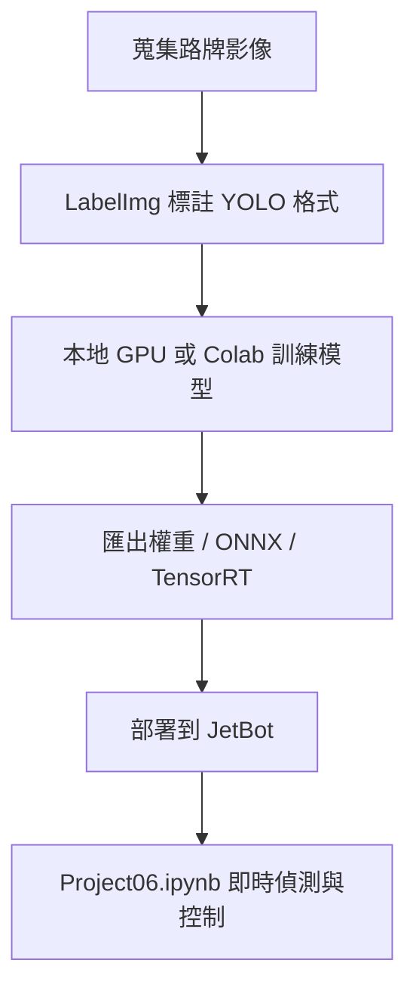

# JetBot 路牌辨識與走直線

**國立臺北科技大學 多媒體技術與應用 Project 6**

這個專案是在做一台 JetBot 自走車的「看路牌、做反應」。系統會偵測 4 種道路標誌，並根據標誌執行對應動作：停止、平交道暫停、行人減速、道路封閉立即停車。整體流程包含資料蒐集、標註、模型訓練、模型轉換，以及部署到 JetBot 上做即時推論與控制。

## 專案在做什麼

- 目標：讓 JetBot 能辨識路牌並自動反應。
- 類別：`stop`、`rail`、`pedestrian`、`blocked`。
- 輸出：訓練好的模型、JetBot 部署檔、以及可直接執行的推論 Notebook。

## 整體流程

## 主要檔案

| 檔案 | 用途 |
|---|---|
| [Project06.ipynb](Project06.ipynb) | JetBot 端即時推論與控制 Notebook |
| [scripts/run_training.bat](scripts/run_training.bat) | 本地 Windows 一鍵訓練與輸出部署檔 |
| [scripts/train_pytorch_yolov4tiny.py](scripts/train_pytorch_yolov4tiny.py) | 本地 GPU 訓練 YOLOv4-tiny 並輸出部署檔 |
| [scripts/train_yolo.py](scripts/train_yolo.py) | Ultralytics 版本的訓練 / 驗證 / 匯出流程 |
| [scripts/predict_vis.py](scripts/predict_vis.py) | 產生驗證視覺化結果，檢查模型辨識品質 |
| [jetbot_deploy/](jetbot_deploy/) | 要複製到 JetBot 的部署檔案 |
| [docs/Local_YOLOv4_Tiny_Guide.md](docs/Local_YOLOv4_Tiny_Guide.md) | 本地 GPU 訓練的詳細指南 |
| [docs/Project6_路牌辨識與走直線.md](docs/Project6_路牌辨識與走直線.md) | 完整版流程與課程說明 |
| [docs/model_analysis.md](docs/model_analysis.md) | 模型與結果分析 |

## 快速上手

如果你只是想先跑起來，建議先做這三步：

1. 確認資料集資料夾完整，尤其是 `obj/`、`_SignDetection.yolo26/`、`_SignDetection.yolov4pytorch/`。
2. 執行 [scripts/run_training.bat](scripts/run_training.bat) 或直接跑 [scripts/train_pytorch_yolov4tiny.py](scripts/train_pytorch_yolov4tiny.py)。
3. 把 `jetbot_deploy/` 的內容放到 JetBot，再打開 [Project06.ipynb](Project06.ipynb) 執行推論。

## 類別與動作

| Class ID | 類別 | JetBot 動作 |
|---|---|---|
| 0 | `stop` | 原地停止後再繼續 |
| 1 | `rail` | 停車等待後再繼續 |
| 2 | `pedestrian` | 減速行駛 |
| 3 | `blocked` | 立即停止 |

## 資料與模型資產

本專案保留了幾種不同階段的資料與模型資產，方便你依照需求切換流程：

- `_SignDetection.yolo26/`：Ultralytics 版本資料集。
- `_SignDetection.yolov4pytorch/`：PyTorch / YOLOv4-tiny 版本資料集。
- `_yolov4tiny_converted/`：轉成 YOLO 格式後的資料。
- `backup/`、`runs/`、`jetbot_deploy/`：訓練輸出、驗證結果與部署檔。

## 目前目錄分區

- `docs/`：完整說明文件、分析報告。
- `scripts/`：訓練、驗證、預測腳本與啟動批次檔。
- `config/`：類別設定、訓練設定與 Darknet 相關配置檔。
- `obj/`、`_SignDetection*/`、`_yolov4tiny_converted/`：資料集與轉換後資料。
- `backup/`、`runs/`、`jetbot_deploy/`：模型輸出與部署檔。

## 文件導覽

- 想先知道專案用途，看這份 README。
- 想看本地高速訓練步驟，看 [docs/Local_YOLOv4_Tiny_Guide.md](docs/Local_YOLOv4_Tiny_Guide.md).
- 想看傳統 Colab / Darknet 流程，看 [docs/Project6_路牌辨識與走直線.md](docs/Project6_路牌辨識與走直線.md).
- 想看模型分析與結果，看 [docs/model_analysis.md](docs/model_analysis.md).

## 團隊資訊

| 項目 | 內容 |
|---|---|
| 指導教授 | 陳彥霖（Yen-Lin Chen） |
| 課程 | 國立臺北科技大學 多媒體技術與應用 |
| 組員 | 113820033 謝奕宏、113820020 林政德、112820034 呂伊茹 |

## 一句話總結

這是一個把路牌辨識模型部署到 JetBot 自走車上的專題，目的是讓車子能看懂路牌並做出即時行為反應。
